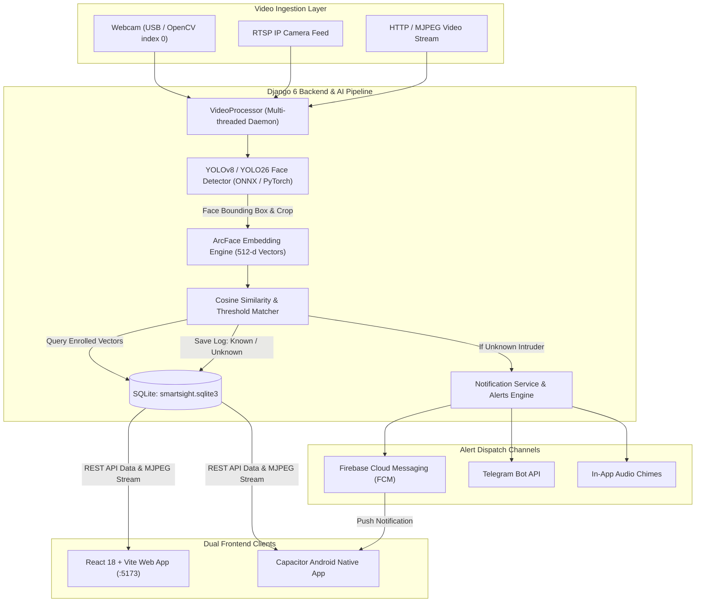

# SmartSight — Comprehensive Platform Documentation

> **SmartSight**: Real-Time AI Face Recognition, Detection, and Surveillance Platform  
> **Author / Lead**: Harsh Shrimali  
> **Last Updated**: August 2026  
> **Status**: Active Production Development  

---

## Table of Contents

1. [Platform Overview](#1-platform-overview)
2. [System Architecture & Data Flow](#2-system-architecture--data-flow)
3. [AI & Computer Vision Engine](#3-ai--computer-vision-engine)
   - [Face Detection Models (YOLOv8 & YOLO26)](#face-detection-models-yolov8--yolo26)
   - [Biometric Embedding Engine (ArcFace 512-d)](#biometric-embedding-engine-arcface-512-d)
   - [Cosine Distance Matching Logic](#cosine-distance-matching-logic)
   - [DBSCAN Face Auto-Classifier](#dbscan-face-auto-classifier)
4. [Backend Implementation (Django 6 REST API)](#4-backend-implementation-django-6-rest-api)
   - [Database Schema & Models](#database-schema--models)
   - [API Endpoints Reference](#api-endpoints-reference)
   - [Video Stream Processing Engine (`video_processor.py`)](#video-stream-processing-engine-videoprocessorpy)
   - [Hybrid Alert & Notification Pipeline](#hybrid-alert--notification-pipeline)
   - [Excel Report Generation Engine (`reports.py`)](#excel-report-generation-engine-reportspy)
5. [Frontend Implementation (React 18 + Vite)](#5-frontend-implementation-react-18--vite)
   - [Glassmorphic UI Design System (`theme.css`)](#glassmorphic-ui-design-system-themecss)
   - [Pages Architecture](#pages-architecture)
   - [Reusable Components & Overlays](#reusable-components--overlays)
6. [Android Mobile App Architecture (Capacitor)](#6-android-mobile-app-architecture-capacitor)
   - [Capacitor Integration & Bridge](#capacitor-integration--bridge)
   - [Dynamic Server Configuration Modal](#dynamic-server-configuration-modal)
   - [Status Bar & Mobile Viewport Handling](#status-bar--mobile-viewport-handling)
   - [Push Notifications Implementation](#push-notifications-implementation)
7. [Developer & Automation Utilities (`tools/`)](#7-developer--automation-utilities-tools)
8. [Implementation Changelog & Fixes Record](#8-implementation-changelog--fixes-record)
9. [Future Workflow & Maintenance Protocol](#9-future-workflow--maintenance-protocol)

---

## 1. Platform Overview

**SmartSight** is a high-accuracy, low-latency, enterprise-grade AI surveillance and biometric face recognition system. It bridges real-time edge/server computer vision with modern web and mobile clients to provide instant situational awareness, intrusion alerting, dataset management, and historical audit reporting.

### Core Capabilities:
- **Zero-Latency Face Detection**: Detects faces in multi-threaded RTSP, HTTP, or USB webcam streams using custom-trained YOLOv8 / YOLO26 models (PyTorch & ONNX Runtime).
- **High-Precision Biometric Recognition**: Extracts 512-dimensional facial feature vectors via ArcFace and performs fast cosine similarity searches against registered identities.
- **Hybrid Alerting Ecosystem**:
  - Web/Mobile client in-app audio chime.
  - Native Android Push Notifications via Firebase Cloud Messaging (FCM).
  - Immediate intrusion alerts via Telegram Bot with captured face snapshots.
- **Automated Stranger Grouping**: Clusters unidentified stranger captures using DBSCAN algorithm to group repeat visitors and accelerate dataset registration.
- **Comprehensive Audit & Analytics**: Detailed recognition timeline, confidence metrics, filterable date windows, and automated `.xlsx` report downloads.
- **Dual-Platform Client**:
  - Responsive Web Application (`frontend`).
  - Native Android Mobile App (`frontend-android` compiled via Capacitor).

---

## 2. System Architecture & Data Flow



---

## 3. AI & Computer Vision Engine

### Face Detection Models (YOLOv8 & YOLO26)
Located in `app/models/`:
- `yolov8n-face.pt` & `yolov8n-face.onnx` (YOLOv8 Nano face detector)
- `yolo26n-face.pt` & `yolo26n-face.onnx` (YOLO26 Nano face detector optimized for higher precision)

**Inference Optimization**:
- The system supports both PyTorch native weights (`.pt`) and ONNX Runtime (`.onnx`) inference.
- Video stream frames are processed on dedicated background worker threads with frame skip control (`PROCESS_EVERY_NTH_FRAME = 2` or `3`) to ensure high FPS playback without CPU/GPU bottlenecks.

### Biometric Embedding Engine (ArcFace 512-d)
Located in `app/utils/embedding_engine.py`:
- Employs DeepFace ArcFace backbone producing unit-normalized 512-dimensional feature representations.
- Faces are cropped with margin, aligned based on facial landmarks, resized to standard input dimensions (112x112 / 160x160), and passed through the model.
- Vector normalization ensures that the dot product directly calculates cosine similarity:
  $$\text{Cosine Similarity} = \frac{\mathbf{u} \cdot \mathbf{v}}{\|\mathbf{u}\|_2 \|\mathbf{v}\|_2} = \mathbf{u}_{\text{norm}} \cdot \mathbf{v}_{\text{norm}}$$

### Cosine Distance Matching Logic
- **Similarity Threshold**: Default threshold range is `0.45 – 0.65` depending on lighting conditions and model tuning.
- If $\max(\text{Similarity}) \ge \text{Threshold}$, the face is marked as **KNOWN** and associated with the matching `Person` profile.
- If $\max(\text{Similarity}) < \text{Threshold}$, the face is flagged as **UNKNOWN** (Intruder), a snapshot is saved to `media/unknown_captures/`, a `RecognitionLog` entry is recorded, and intrusion alert workflows trigger.

### DBSCAN Face Auto-Classifier
Located in `app/utils/face_classifier.py`:
- Clusters unlabelled stranger captures saved in `media/` into distinct clusters using Density-Based Spatial Clustering of Applications with Noise (DBSCAN).
- Generates candidate person groups automatically, allowing administrators to bulk-register recurring individuals without manual sorting.

---

## 4. Backend Implementation (Django 6 REST API)

### Database Schema & Models
Located in `app/models.py`:

| Model | Purpose | Key Fields |
| :--- | :--- | :--- |
| `User` | Extended user entity with optional access codes | `username`, `password`, `code`, permissions |
| `Camera` | Video feed sources and display orientations | `name`, `source`, `orientation` (normal, rot90_cw, rot90_ccw, flip180, mirror_h), `is_active` |
| `Person` | Registered biometric subjects / VIPs / personnel | `name`, `created_at` |
| `PersonImage` | Source enrollment photos for a `Person` | `person` (FK), `image` (stored in `dataset/<name>/`), `uploaded_at` |
| `PersonEmbedding` | Precomputed 512-d feature vectors for instant lookup | `person` (FK), `source_image` (FK), `embedding` (JSONField array of 512 floats) |
| `RecognitionLog` | Historical audit logs of every detected face event | `person_name`, `camera_name`, `confidence`, `detection_confidence`, `recognition_similarity`, `status` (`KNOWN`/`UNKNOWN`), `image_path`, `timestamp` |
| `Notification` | Dispatch history of intrusion alerts | `title`, `message`, `image_url`, `status` (`PENDING`, `APPROVED`, `CANCELLED`, `EXPIRED`), `action_source`, `telegram_message_id` |
| `DevicePushToken` | FCM device push tokens for native Android notifications | `user` (FK), `token`, `platform` (android/ios), `created_at` |

### API Endpoints Reference
Configured in `app/urls.py` and `smartsight/urls.py`:

- **Authentication**:
  - `POST /api/login/`: Username and password authentication with token generation.
  - `POST /api/verify-code/`: Secondary authentication via access codes.
- **Surveillance & Streams**:
  - `GET /api/video-feed/<camera_id>/`: Real-time multipart/x-mixed-replace MJPEG video stream with dynamic bounding box overlays and detection telemetry.
  - `GET /api/cameras/`: Retrieve configured camera list.
  - `POST /api/cameras/`: Register new camera (RTSP URL or device index).
  - `PUT/DELETE /api/cameras/<id>/`: Update orientation or remove camera.
- **Biometric Dataset**:
  - `GET /api/persons/`: List enrolled persons with thumbnail counts.
  - `POST /api/persons/`: Register new person identity.
  - `POST /api/persons/<id>/upload/`: Upload images to person profile and automatically trigger embedding extraction.
  - `POST /api/compute-embeddings/`: Manually trigger recalculation of all facial vectors.
- **Logs & Audit Reporting**:
  - `GET /api/recognition-logs/`: Filterable recognition log history (query params: `date_from`, `date_to`, `status`, `camera`).
  - `GET /api/reports/export-excel/`: Stream-generate `.xlsx` audit sheet with formatted summary cards and event tables.
  - `GET /api/reports/analytics/`: High-level counts, intrusion ratios, and peak activity metrics.
- **Notifications & Approvals**:
  - `GET /api/notifications/`: List active and past alert entries.
  - `POST /api/notifications/<id>/action/`: Approve or dismiss intruder notification.
  - `POST /api/push-token/`: Register Android FCM token.

### Video Stream Processing Engine (`video_processor.py`)
- Encapsulated in `VideoProcessor` class.
- Uses `cv2.VideoCapture` with non-blocking buffer reading to avoid RTSP stream lag.
- Implements orientation transformation matrix for `rot90_cw`, `rot90_ccw`, `flip180`, and horizontal mirror.
- Computes detection bounding boxes, applies non-maximum suppression (NMS), runs ArcFace identification against the cached embedding database, and annotates frames with stylish HUD bounding boxes, name tags, and confidence scores.

### Hybrid Alert & Notification Pipeline
Located in `app/utils/alerts.py` and `app/services/notification_service.py`:
- **Cooldown Throttle**: Prevents alert floods when an unknown person stands in front of the camera for multiple seconds. Configurable cooldown window (default: 30–60 seconds per camera).
- **Firebase Cloud Messaging (FCM)**: Sends rich push notifications containing captured face snapshots and sound trigger to enrolled Android devices (`firebase-credentials.json`).
- **Telegram Bot**: Sends photo message with interactive inline approval buttons (`Approve` / `Reject`) directly to configured Telegram channels/chats.

### Excel Report Generation Engine (`reports.py`)
- Uses `openpyxl` with custom styling: dark title bars, auto-fitting column widths, conditional formatting (green for `KNOWN`, red for `UNKNOWN`).
- Generates multi-sheet reports including:
  1. Executive Summary (total scans, known vs unknown ratio, top cameras).
  2. Complete Detailed Audit Trail (timestamp, camera, identity, detection confidence, similarity score).

---

## 5. Frontend Implementation (React 18 + Vite)

### Glassmorphic UI Design System (`theme.css`)
- **Visual Style**: Cyberpunk telemetry aesthetic, high-contrast dark palette, translucent frosted glass (`backdrop-filter: blur(16px)`), ultra-thin refractive borders (`rgba(255, 255, 255, 0.08)`).
- **Typography**: Modern font stack utilizing Plus Jakarta Sans / Inter for UI copy and Google Sans Code / Roboto for telemetry metrics and confidence scores.
- **Responsive Layout**: Optimized for dual viewport scenarios: wide 4K desktop surveillance dashboards and compact mobile phone viewports.

### Pages Architecture
Located in `frontend/src/pages/` and `frontend-android/src/pages/`:

1. **`HomePage.jsx`**:
   - Live system status overview, active cameras count, total enrollments, quick-action shortcuts.
2. **`DetectionPage.jsx`**:
   - Primary surveillance HUD. Displays real-time camera stream, live status pill (`STREAM ACTIVE`), overlay toggles, camera switcher, and instant alert chime.
3. **`CamerasPage.jsx`**:
   - Camera fleet management. Add/edit/delete RTSP streams, test connections, and adjust camera rotation/mirroring orientations.
4. **`DatasetPage.jsx`**:
   - Biometric registry. Person directory, image gallery, multi-file drag-and-drop uploader, lazy loading, and embedding status badges.
5. **`ReportsPage.jsx`**:
   - Audit and analytics portal. Dynamic date range pickers, status filters (`ALL`, `KNOWN`, `UNKNOWN`), interactive telemetry cards, pagination, and one-click Excel download.
6. **`NotificationsPage.jsx`**:
   - Security alerts inbox. Intrusion snapshot inspection, timestamp metadata, approve/dismiss actions, and Telegram verification badges.
7. **`LoginPage.jsx` & `ForgotPasswordPage.jsx`**:
   - Secure login portal with glass card, animated background, code recovery, and session token storage.
8. **`AboutPage.jsx`**:
   - Project specifications, team attribution, architectural diagrams, and license details.

### Reusable Components & Overlays
Located in `src/components/`:
- `Navbar.jsx`: Glassmorphic navigation header with live indicator, server status, and route navigation.
- `Footer.jsx`: Minimalist footer with platform versioning.
- `CyberBackground.jsx` & `ParticleBackground.jsx`: Ambient canvas/CSS particle system creating a high-tech surveillance look.
- `UnknownCapturesModal.jsx`: Modal popup reviewing recent unidentified captures for fast categorization.
- `ErrorBoundary.jsx`: React component error boundary preventing white-screen crashes.

---

## 6. Android Mobile App Architecture (Capacitor)

The mobile client (`frontend-android/`) is configured as an independent Capacitor Android project compiled to a native debug/release APK.

### Dynamic Server Configuration Modal (`ServerConfigModal.jsx`)
- Solves hardcoded backend IP issues. Mobile users can configure and switch the Django backend URL (e.g., `http://192.168.1.100:8000`) directly from the login/navbar screen without rebuilding the Android APK.
- Persisted in mobile `localStorage` and dynamically applied to all Axios API calls.

### Status Bar & Mobile Viewport Handling
- Fixed status bar overlap issues where mobile content clashed with the Android top status bar.
- Implemented `themeStatusBar.js` to dynamically set status bar style and background color matching the dark glassmorphic theme.
- CSS safe-area padding (`env(safe-area-inset-top)`) and scrollbar hiding rules for smooth native feel.

### Push Notifications Implementation
- Configured `@capacitor/push-notifications` to register FCM device tokens upon user login.
- Device push tokens are sent to `POST /api/push-token/` and stored in Django `DevicePushToken` table for targeted alert delivery.

### Compilation Pipeline
```bash
cd frontend-android
npm run build
npx cap sync android
cd android
.\gradlew assembleDebug
```
Output: `frontend-android/android/app/build/outputs/apk/debug/app-debug.apk`

---

## 7. Developer & Automation Utilities (`tools/`)

Located in `tools/`:

- **`compute_all_embeddings.py`**:
  - Utility script that iterates over all images in `media/dataset/`, detects facial landmarks, runs ArcFace inference, and saves 512-d vectors into `PersonEmbedding` table in the database.
- **`generate_dataset_doc.py`**:
  - Automates generation of institutional permission letters, student collection sheets, and consent undertaking letters (`.docx`) for ethical dataset collection.
- **`label_studio.py`**:
  - Integration script connecting SmartSight dataset images with Label Studio for bounding box and facial attribute annotation.
- **`send_test_notification.py`**:
  - Diagnostic script to test FCM push notification delivery to registered Android tokens.

---

## 8. Implementation Changelog & Fixes Record

All historic fixes and improvements are tracked here and in `COMMITS.txt`:

| Commit / Date | Category | Summary of Implementation |
| :--- | :--- | :--- |
| **Pending** (2026-08-26) | UI / Typography | Configured Google Fonts `Inter` via dual pipeline: live `@import url('https://fonts.googleapis.com/css2?family=Inter:wght@100..900&display=swap')` for immediate online browser rendering + offline discrete weights (`400`, `500`, `600`, `700` woff2) and variable TTF `@font-face` suite. |
| **Pending** (2026-08-26) | Android / Assets | Downloaded official `google/fonts` repository `Inter-VariableFont.ttf` & `Inter-Italic-VariableFont.ttf` (weights 100–900 with full optical size glyphs), configured `@font-face` definitions directly inside `fonts.css` and `theme.css`, and mapped global CSS variables. |
| **Pending** (2026-08-26) | Camera / Windows | Resolved MSMF `grabFrame` Error `-1072873821` by setting `OPENCV_VIDEOIO_PRIORITY_MSMF=0` to enforce DirectShow (`CAP_DSHOW`), removing problematic `FOURCC('MJPG')` requests on raw YUY2 webcams, and implementing adaptive poll backoff to stop console warning spam. |
| **Pending** (2026-08-26) | Camera / Stream | Optimized FFmpeg network socket timeout (`OPENCV_FFMPEG_CAPTURE_OPTIONS`) to 2 seconds to prevent thread blocking on unreachable IP streams; added automatic URL schema and endpoint auto-completion (auto-resolving `/video` on IP Webcam port 8080/4747). |
| **Pending** (2026-08-26) | AI / Models | Repaired corrupted `yolo26n-face.onnx` protobuf by re-exporting clean ONNX model from PyTorch; implemented automated multi-tier fallback loading across `embedding_engine.py` and `video_processor.py` to prevent stream crashes. |
| **a244ac5** (2026-08-26) | Android / UI | Fixed status bar overlap with safe-area insets; removed mobile side scrollbars; added `ServerConfigModal.jsx` for dynamic backend URL setup on APK; refined `theme.css`. |
| **95b001b** (2026-08-26) | Assets / Branding | Updated high-resolution app icons (`app_icon.png`, `app_icon_round.png`), adaptive favicons, removed local font bloat, updated index headers. |
| **4393825** (2026-08-26) | Android / Styling | Fixed mobile viewport height bugs and layout flex overflow issues. |
| **4ba19dd** (2026-08-25) | AI / Features | Integrated YOLO26 and YOLOv8 face detection weights (`.onnx` & `.pt`); implemented ArcFace 512-d `embedding_engine.py`; overhauled ReportsPage with glassmorphic audit tables and Excel exports; added FCM push & Telegram notification pipeline. |
| **7b84eb7** (2026-08-11) | Backend Fix | Corrected `datetime` import syntax and fixed empty timestamp handling in recognition log queries. |
| **1eba0e8** (2026-08-11) | Initial Architecture | Scaffolded initial Django models, REST API, React Vite frontend, and Capacitor mobile app structures. |

---

## 9. Future Workflow & Maintenance Protocol

To ensure seamless git tracking and up-to-date documentation:

1. **Whenever a fix or feature is implemented**:
   - **Step 1**: Append a new entry to `COMMITS.txt` with conventional commit message, detailed description, list of files, and ready-to-run `git commit` commands.
   - **Step 2**: Update `DOCUMENTATION.md` under Section 8 (Changelog) and in any relevant architecture section affected by the changes.
2. Both files will remain permanently in sync, providing:
   - Instant copy-paste git commit capability (`COMMITS.txt`).
   - Comprehensive technical reference for academic, professional, and development documentation (`DOCUMENTATION.md`).
